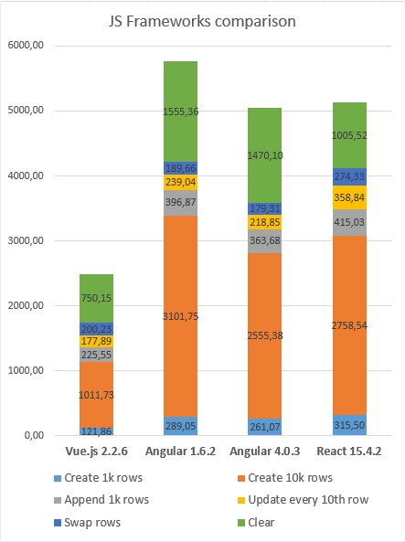
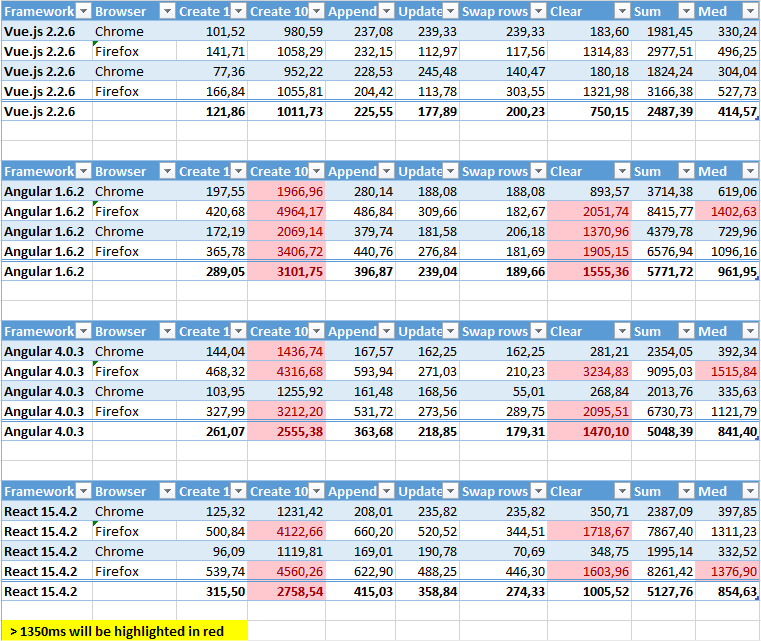

title: Vue.js
class: animation-fade
layout: true

<!-- This slide will serve as the base layout for all your slides -->
.bottom-bar[
  {{title}}
]

---

class: impact

# {{title}}
## Introduction to Vue.js framework

---

# The basics

> Vue (pronounced /vjuː/, like view) is a progressive framework for building user interfaces.

- Data binding/states to the DOM

???
- Angular 1 two-way binding between scopes and VUE enforces a one-way data flow between components

--

- Virtual DOM
> Working with a copy of DOM and update differences in real DOM

???
- DOM stands for Document Object Model

--

- Reactive: data changes => DOM changes

???
- Related with virtual DOM

--

- A Vue instance/component works like a (view)model. Populating and mutating its own data

???
- Isolated components in .vue files

---

# Why Vue.js?

--

- Fast

- Small

- Easy to write *(use .vue files)*

- Easy to install *(vue-cli manager)*

- Detailed, clean and understandable docs

- No one million thousand dependencies

---

# Why Vue.js? (in numbers)

--

.col-6[
- Fast
]

.col-6[
- *~56%* faster than `Angular v1.6.2` 
- *~50%* faster than `Angular v4.0.3` 
- *~51%* faster than `React v15.4.2`
]

--

.col-6[
- Small
]

.col-6[
- `Vue.js v2.2.6`: **~60KB**
- `Angular v1.6.2`: *~264KB* 
- `Angular v4.0.3`: *~848KB*
- `React v15.4.2`: *~152KB*
]

--

.col-12[
> Values are based on my own experience and using a "benchamark" for it [https://github.com/krausest/js-framework-benchmark](https://github.com/krausest/js-framework-benchmark)
]

---

# Benchmark numbers

.col-6.center[

]

--

.col-6.center[

]

---

# Vue Instance

- An application is started with one Vue Instance

--

.col-6.center[
**javascript**

``` javascript
new Vue({
  el: '#app',
  data() {
    return {
      greeting: 'Hello all!',
    };
  },
});
```
]

--

.col-5.col-offset-1.center[
**HTML**

``` html
<div id="app">
  <h1>{{ greeting }}</h1>
</div>
```
]

--
 
.col-5.col-offset-1[
**Result**
 
``` html
<div id="app">
  <h1>Hello all!</h1>
</div>
```
]

---

# Basics - Properties and Methods

- `data`: Object with stored properties that become reactive
- `computed`: Inside this Object you could find computed properties (es6 getters/setters)
- `methods`: Object with stored functions to use inside component/instance or in its html template

> Vue proxies all properties in *data*, *computed*, and *methods* to *root* object

---

# Basics - Lifecycles

.col-3[

]

.col-6[
- beforeCreate
- created
- beforeMount
- mounted
- beforeUpdate
- updated
- beforeDestroy
- destroyed
]

---

# Basics - Directives

- Directives are special attributes with the `v-` prefix. Directive attribute values are expected to be a **single JavaScript expression**

``` html
<p v-if="seen">Now you see me</p>
<p v-else>Nothing to see</p>
```

- Some vue directives

v-for, v-if, v-else-if, v-else, v-show, v-text, v-bind, v-on...

- Can create custom directives 

---

# Basics - (Interpolations)

- Using as text

``` html
<span>Message: {{ msg }}</span>
```

- Using as html

``` html
<span v-html="msgHtml"></span>
```


---

# Components

> Components are one of the most powerful features of Vue. They help you extend basic HTML elements to encapsulate reusable code

--

- Components live inside a `Vue Instance`

- Registered with and `id` that will be the tag in DOM for the component

- Components are reusable

- Components could be global or local

---

# Components example code (global)

.col-6[
``` javascript
// register
Vue.component('a-component', {
  template: '<div>Hi!</div>',
});

// create a root instance
new Vue({
  el: '#example',
});
```
]

.col-5.col-offset-1[
``` html
<div id="example">
  <a-component></a-component>
</div>
```
]

.col-5.col-offset-1[
**Result**

``` html
<div id="example">
  <div>Hi!</div>
</div>
```
]

---

# Components example code (local)

.col-6[
``` javascript
// register
var Child = {
  template: '<div>Hi!</div>',
};

// create a root instance
new Vue({
  el: '#example',
  components: {
    'a-component': Child,
  },
});
```
]

.col-5.col-offset-1[
``` html
<div id="example">
  <a-component></a-component>
</div>
```
]

.col-5.col-offset-1[
**Result**

``` html
<div id="example">
  <div>Hi!</div>
</div>
```
]

---

# Data and Props

- The core of a Vue Instance/Component

- Two different purposes

---

# Vue Data

- Scoped to the component

- Should not be altered from outside the component

- Can not receive data from parent

- Can pass data to child components

---

# Vue Props

- VueJS uses one way data flow, from parent to child

- `Parent` passes data to child and `Child` receives it as a prop

- If `Parent` changes data, prop changes in `Child`

--

- Component **should not** directly alter its own props
> A child component needs to explicitly declare the props it expects to receive using the props option Docs

--

- Two different type of props:
    - dynamic
    - static
    
???

Using v-bind in props

- dynamic
    - &lt;some-component `v-bind:`someprop=&quot;`dataValue`&quot;&gt;&lt;/some-component&gt;

- static
    - &lt;some-component someprop=&quot;`string value`&quot;&gt;&lt;/some-component&gt;

---

# Vue Parent-Child communication

.col-12[
- Parent use a child component and pass props to it

``` html
<div id="example">
  <child :myprop="oneProp" @theevent="alert"></child>
</div>
```
]

.col-12[
- Child captures the prop and `$emit` an event

``` javascript
var Child = {
  props: ['myprop'],
  template: '<button @click="$emit(\'theevent\', aValue)">Click</button>'
};
```
]

---

# Props validation

.text-small[
``` javascript
Vue.component('example', {
  props: {
    propA: Number,
    propB: [String, Number],
    propC: {
      type: Number,
      default: 100
      required: true
    },
    propE: {
      type: Object,
      default: function () {
        return { message: 'hello' }
      }
    },
    propF: {
      validator: function (value) {
        return value > 10
      }
    }
  }
})
```
]

---

# Computed properties

- Return a property, based on es6 getters and setters

- Computed properties are reactive

---

# Computed properties (example)

.col-6[
**javascript**

``` javascript
new Vue({
  el: '#example',
  data() {
    return {
      hello: 'Hello',
    };
  },
  computed: {
    greet() {
      return this.hello + ' all!';
    },
  },
});
```

]

.col-5.col-offset-1[
**HTML**

``` html
<div id="example">
  {{ greet }}
</div>
```

PD: without `()`, it is a 'value', not a function

]

???
It will run the function only if any of the "variables inside the computed code" is changed

---

# Computed properties (advanced)

``` javascript
// ...
computed: {
  fullName: {
    // getter
    get: function () {
      return this.firstName + ' ' + this.lastName;
    },
    // setter
    set: function (newValue) {
      var names = newValue.split(' ');
      this.firstName = names[0];
      this.lastName = names[names.length - 1];
    },
  },
},
// ...
```

---

# Bindings

- `Events`: Easily bind any event *(click, input, change...)* and apply modifiers on it *(prevent default, stop propagation, native...)*

``` html
<button v-on:click.prevent="anyFunction">Click button</button>
<button @click.prevent="anyFunction">Click button</button> // shorthand
```

- `HTML attributes`: Easily bind any js expresion to any html attribute *(class, style, id...)*

``` html
<div v-bind:title="anyVariable"></div>
<div :title="anyVariable"></div> // shorthand
```

---

# Bindings (example)

.col-6[
**javascript**

``` javascript
new Vue({
  el: '#example',
  data() {
    return {
      hello: 'Hello',
    };
  },
  computed: {
    greet() {
      return this.hello + ' all!';
    },
  },
});
```
]

.col-5.col-offset-1[
**HTML**

``` html
<div id="example"
     v-bind:title="greet">
  {{ greet }}
</div>
```
]

---

# v-model binding

``` html
<!-- `picked` is a string "a" when checked -->
<input type="radio" v-model="picked" value="a">

<!-- `toggle` is either true or false -->
<input type="checkbox" v-model="toggle">

<!-- `selected` is a string "abc" when selected -->
<select v-model="selected">
  <option value="abc">ABC</option>
</select>
```

- It could be used in custom components

``` html
<my-component v-model="value"></my-component>
```

---


---

# Filters

- Vue does not include filters in core but you could define a new one like:

``` javascript
new Vue({
  // ...
  filters: {
    capitalize: function (value) {
      if (!value) { return ''; }
      value = value.toString();
      return value.charAt(0).toUpperCase() + value.slice(1);
    },
  },
});
```

- Filters could be chained

``` html
{{ message | filterA | filterB }}
```

---

class: center

# End